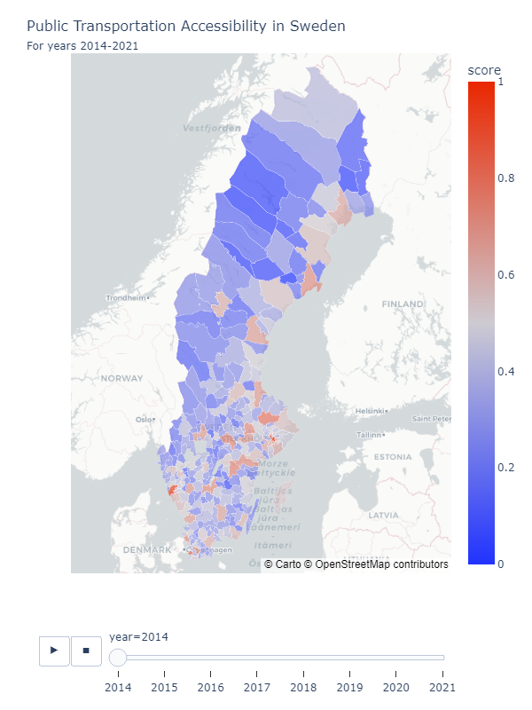
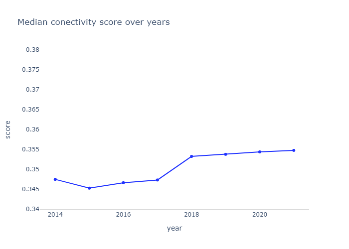
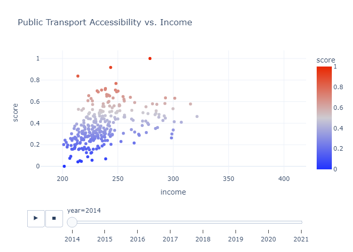
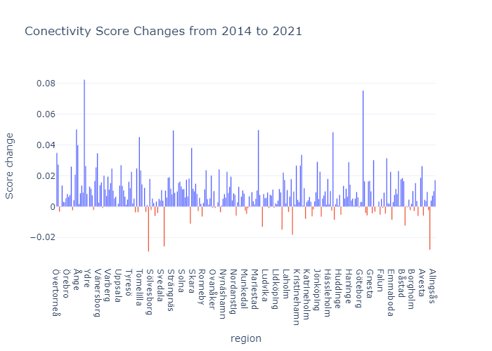
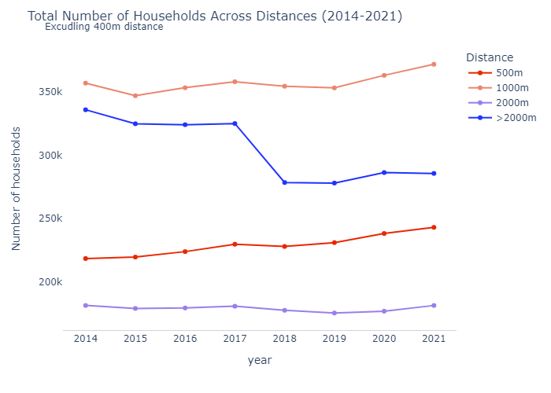

📈 Check all vizalizations with full interactivity [Streamlit app](https://urban-connectivity-2013-2021.streamlit.app/)

# Urban Connectivity: Analyzing Housing Growth and Accessibility to Public Transportation in Sweden
## Main focus
The goal of this analysis is to examine the interplay between **urban development** dynamics, proximity to **public transportation** and **income**. 

Analysis will try to find answers to questions like:
- Are there any observable trends in hosuing development relative to different distances from public transportation?
- Are certain municipalities better connected to public transportation?
- How does the accessibility of residential areas to communication vary across different income brackets?
- Is newly build hosuing better connected to public transportation or not? What is the trend?

## Data
Main data source for the project is Statistikmyndigheten SCB (https://www.scb.se).

Data sets shows number of apartments in each municipality in Sweden for years 2014-2021 and thier proximity to public transportation. There are 4 proximity groups:
- 400m
- 500m
- 1000m
- 2000m

Public transportation nodes only with certatin frequency  were taken into consideration. Critera was that there is at least one connection every hour during working days between 06.00-22.00. 

The distance also was calucated in a straigh line (crow-fly distance), not by actual walking distance. 

**Tables used in analysis:**
- Housing_400m_2014_2020.csv
- Housing_500m_2014_2020.csv
- Housing_1000m_2014_2020.csv
- Housing_2000m_2014_2020.csv
- Housing_total_2014_2020.csv
- Income_2014_2020.csv

- swedish_municipalities.geojson\
&emsp; source: https://github.com/okfse/sweden-geojson
(based on Valmyndigheten data)

### Calculating Conectivity Score

Each household was calculated once to get more realistic score. For example households in distance 400m were exculded from number of households in 500m distance etc. 

To obtain common score for each municipality, the Conectivity Score was calucated giving higher weight to houses that are closer to public transportation: 
- 400m - weight: 1.0
- 500m - weight: 0.8
- 1000m - weight: 0.6
- 2000m - weight: 0.4
- more 2000m - weight: 0.2 *

*Households with poor connection was summed in group "more 2000m"

Weighted connectivity score were at last normalized to make it more comparable with the following formula: 
  

&emsp;&emsp;&emsp;&emsp;&emsp;
  
Other aggregations are described in jupyter notebook.

## Main insights from analysis
### Urban Advantage: Access to Public Transportation 

Larger municipalities housing major cities such as Stockholm, Gothenburg, Malmö, and Uppsala demonstrate superior access to public transportation compared to smaller counties. Notably, this advantage remained almost unchanged from 2014 to 2021.

### Overall Public Transportation Access

The median access to public transportation across all municipalities exhibited an upward trend over the years, indicating an overall improvement in connectivity.

### Cities gives more equal opportunities

Despite variations in income levels, urban centers demonstrate a propensity to offer better connectivity to public transportation. This suggests that cities play a pivotal role in providing equal opportunities for transportation access.

### Change was not always positive

While most municipalities witnessed a positive change in connectivity from 2014 to 2021, some areas experienced a decline. This underscores the dynamic nature of transportation infrastructure development. 

### Growing Reach: Household Connectivity

The overall growth in connectivity can be attributed to the construction of new apartments annually. Interestingly, the only segment showing a decrease in connectivity is households without access, indicating a positive shift in public transportation accessibility.

